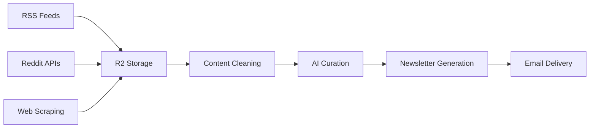

# AI Newsletter Automation System

A comprehensive n8n workflow system for automated AI newsletter generation, from content discovery to final newsletter delivery.

## 🏗️ System Architecture

This system implements a complete AI newsletter automation pipeline with multiple phases:

### **Phase 1A: Content Discovery**
- **RSS Scan and Upload**: Monitors 6 AI newsletter sources via RSS feeds
- **Reddit Scan and Upload**: Scrapes 3 Reddit AI communities for trending content
- **Web Scan and Upload**: Direct web scraping capabilities (planned)

### **Phase 1B: Content Processing**
- Downloads and consolidates raw content from R2 storage
- Advanced content cleaning (47.7% noise reduction)
- Date range filtering and duplicate prevention

### **Phase 2: AI-Powered Curation**
- Semantic content analysis and relevance scoring
- Smart deduplication using Jaccard similarity
- Quality evaluation and source diversity optimization
- Selects top 4 stories from all sources

### **Phase 3A: Newsletter Generation**
- AI-powered subject line generation with alternatives
- Professional Axios-style formatting (Recap/Unpacked/Bottom Line)
- Dynamic content adaptation for AI enthusiasts
- Complete markdown newsletter output

## 📁 Repository Contents

### **Core Workflow Files**
- `Phase 1A_ RSS Scan and Upload.json` - RSS feed monitoring workflow
- `Phase 1A_ Reddit Scan and Upload (2).json` - Reddit community scraping workflow (✨ **Latest**)
- `Phase 1A_ Web Scan and Upload (2).json` - Web scraping workflow
- `Phase 1B_ RSS Download and Consolidation.json` - Content processing and cleaning
- `CLAUDE.md` - Complete project documentation and progress tracking

### **Documentation**
- `README.md` - This file
- `CLAUDE.md` - Comprehensive technical documentation with architecture details

## 🚀 Quick Start

### **Prerequisites**
- n8n automation platform
- Cloudflare R2 storage bucket (`n8n-ai-news-stories`)
- OpenAI API key (GPT-5-mini)
- Firecrawl API for web scraping
- Reddit OAuth2 API credentials
- Gmail OAuth2 for notifications

### **Setup Instructions**

1. **Import Workflows**
   ```bash
   # Import each JSON file into your n8n instance
   # Configure credentials for each service
   ```

2. **Configure R2 Storage**
   - Bucket name: `n8n-ai-news-stories`
   - Credential ID: `WRnQEZaYQvFm8YY3` (Cloudflare R2 S3 Format Datalake)

3. **Set Up Credentials**
   - OpenAI API: `0h9ABSgX9AueTiCT`
   - Reddit OAuth2: `Qbblv31PMg4lH2Xu`
   - Gmail OAuth2: `DbgMOOrFimJRx5qQ`
   - Firecrawl API: `rTqOqmBm7ntAnREG`

4. **Schedule Configuration**
   - Phase 1A RSS: Daily 5:00-6:15am (staggered 15min intervals)
   - Phase 1A Reddit: Daily 5:00-5:20am (staggered 10min intervals)
   - Phase 1B: Weekly processing trigger
   - Phase 2: Automatic after Phase 1B completion
   - Phase 3A: Automatic after Phase 2 completion

## 📊 Data Flow



### **File Naming Convention**
- **Input**: `{YYYY-MM-DD}/{title}.{source}.md`
- **Processed**: `newsletter-combined-{YYYY-MM-DD}.md`
- **Curated**: `curated-stories-{YYYY-MM-DD}.json`
- **Final**: `newsletter-{YYYY-MM-DD}.md`

## 🔧 Current Sources

### **RSS Sources (6 active)**
- The Neuron Daily
- Futurepedia
- Superhuman AI
- The Rundown AI
- Ben's Bites
- TAAFT (There's An AI For That)

### **Reddit Sources (3 active)**
- r/artificial
- r/openai
- r/ArtificialIntelligence

### **Planned Expansions**
- Import AI newsletter
- The Batch (DeepLearning.AI)
- The Sequence
- AI Breakfast
- Direct web scraping of AI company blogs

## 🧠 AI Integration

### **Models Used**
- **GPT-5-mini**: Content relevance evaluation, external URL extraction
- **Claude 3.5**: Newsletter generation, subject line creation, story formatting

### **AI Features**
- Semantic content analysis for relevance scoring
- Automatic duplicate detection using NLP similarity
- Dynamic subject line generation with A/B testing options
- Context-aware content summarization
- Professional writing style adaptation

## 📈 Performance Metrics

### **Content Processing**
- **Noise Reduction**: 47.7% promotional content removed
- **Processing Speed**: 3-5 minutes end-to-end
- **Quality Score**: 7.7/10 average story quality
- **Diversity Score**: 10/10 source representation

### **Curation Results**
- **Input**: 11+ articles daily across all sources
- **Output**: 4 high-quality curated stories
- **Duplicate Removal**: ~1-2 articles filtered daily
- **Relevance Filtering**: 90%+ AI-relevant content

## 🔄 System Enhancement Plan

### **Stage 1: Content Cleaning** ✅ **COMPLETED**
- Advanced promotional content removal
- Enhanced URL cleaning and deduplication
- Date range filtering and content validation

### **Stage 2: Enhanced Intelligence** 🚧 **PLANNED**
- Claude-powered semantic relevance scoring
- Advanced ranking algorithms with recency weighting
- Trending topic detection and prioritization

### **Stage 3: Dynamic Presentation** 📋 **PLANNED**
- A/B testing framework for subject lines
- Personalized content formatting
- Rich newsletter templates with enhanced styling

## 🛠️ Debugging & Maintenance

### **Common Issues**
- **S3 Operations**: Use "getAll" not "getMany" for R2 compatibility
- **Node References**: Always use exact display names in expressions
- **Date Validation**: Enhanced mismatch detection with severity classification
- **Rate Limiting**: 5-second delays between Reddit API calls

### **Monitoring**
- Gmail notifications for all workflow completions
- Date mismatch alerts with severity classification
- Processing statistics and quality metrics
- Error handling with retry mechanisms

## 📋 Todo/Roadmap

### **Phase 3B: HTML Email Templates**
- Responsive email design with mobile optimization
- Multiple template options (minimal, rich, branded)
- Email client compatibility testing

### **Phase 4: Distribution System**
- Subscriber management integration
- Email delivery optimization for high deliverability
- Analytics tracking and engagement metrics

### **Phase 5: Analytics Dashboard**
- Performance tracking and optimization insights
- Content quality analysis over time
- Source effectiveness measurement

## 🤝 Contributing

This is a production newsletter automation system. For modifications:

1. Test changes on development workflows first
2. Maintain backward compatibility with existing file structures
3. Update documentation for any architectural changes
4. Validate end-to-end pipeline after modifications

## 📄 License

Private repository for newsletter automation system.

## 📞 Support

For technical issues or enhancements, refer to the detailed documentation in `CLAUDE.md` which contains:
- Complete system architecture
- Debugging guides
- Performance optimization notes
- Production deployment instructions
- Historical development notes and lessons learned